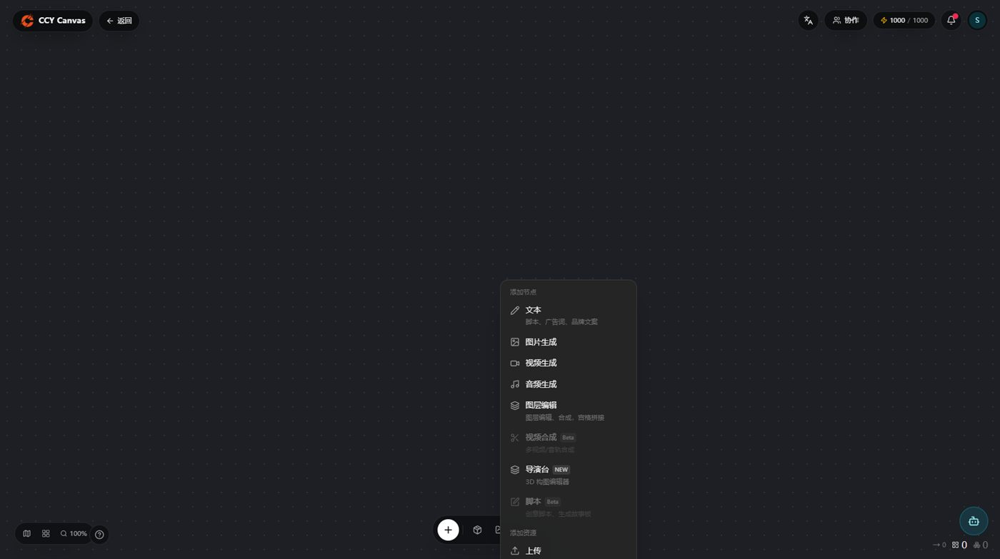
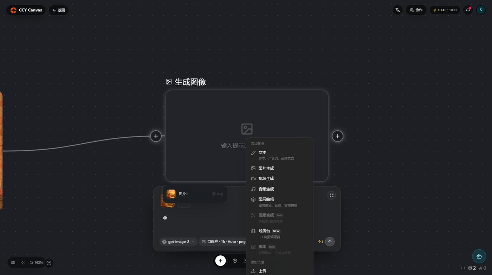
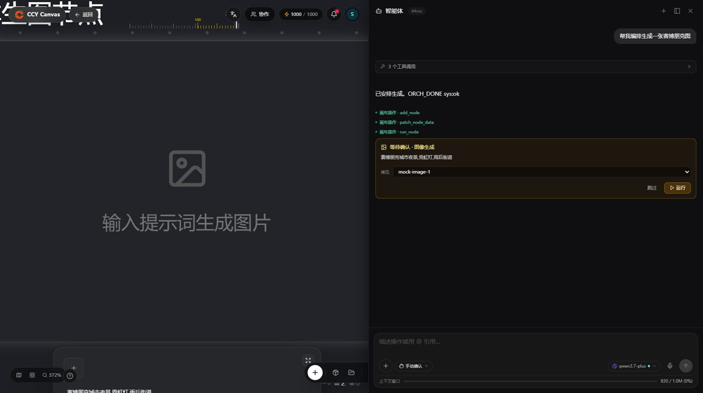
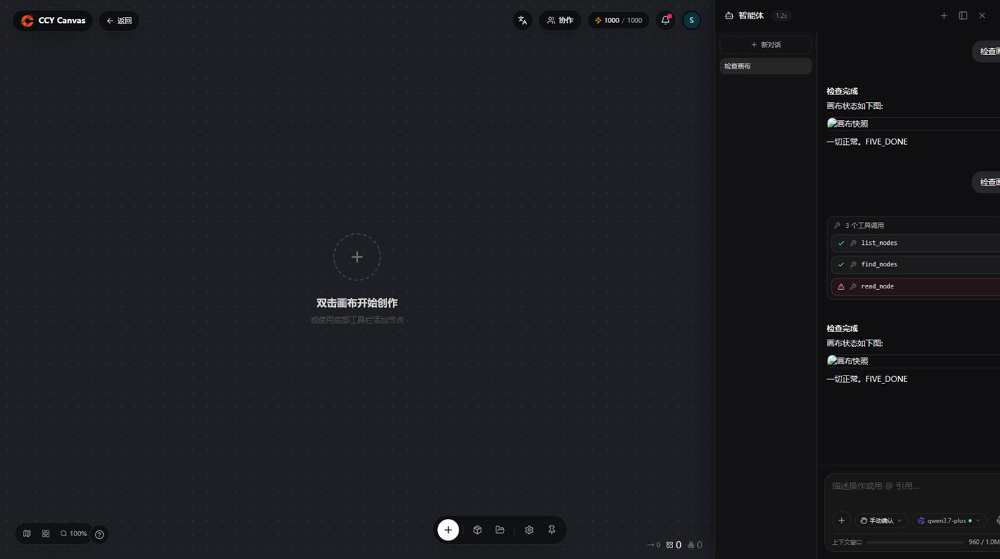
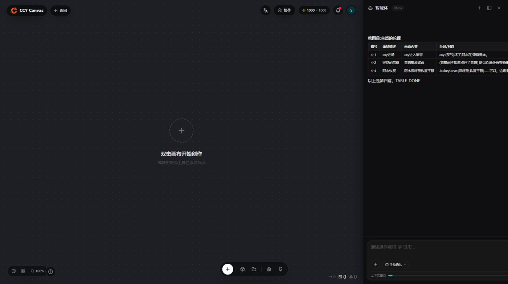
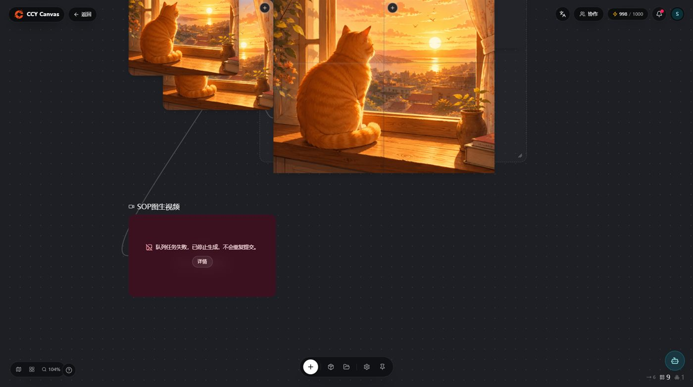
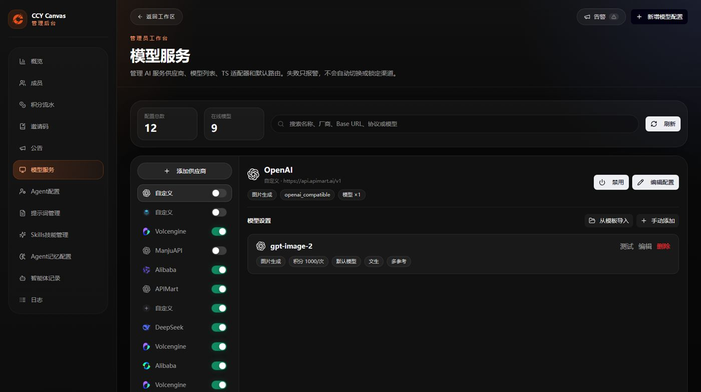
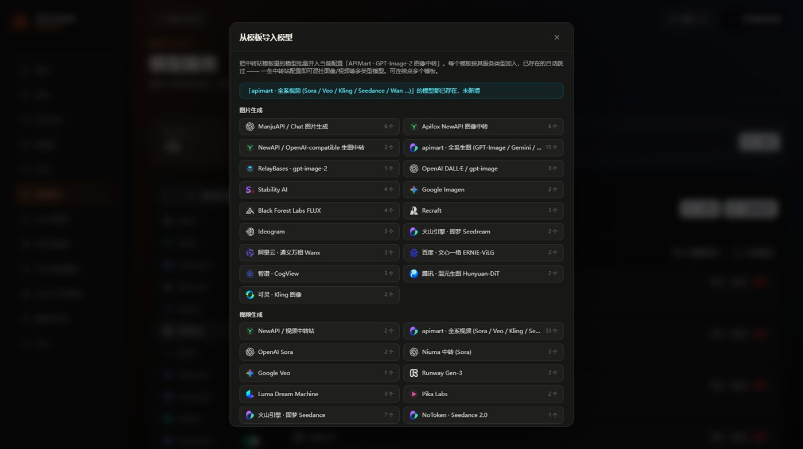
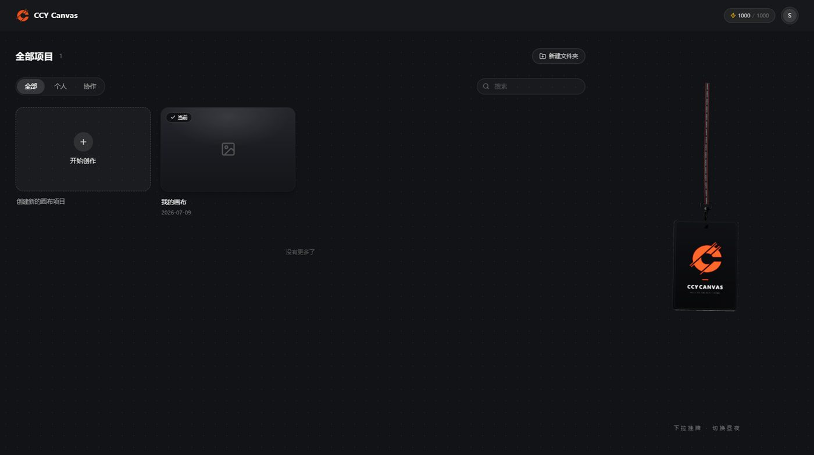

# CCY Canvas · 橙次元

**节点式 AI 生成画布** —— 在一张无限画布上编排 图像 / 视频 / 文本 / 音频 的完整创作工作流。多厂商模型中转、AI 智能体、团队协作、积分计费、管理后台,开箱即用。


---

## ✨ 核心功能

### 🎨 无限画布 · 节点工作流

一切创作都是节点:双击画布添加 文本 / 图片 / 视频 / 音频 / 图层编辑 / 导演台 节点,拖线连接即成工作流。滚轮缩放、框选多选、全局撤销重做、小地图导航。



### 🖼 AI 生成:文生图 · 图生图 · 图生视频

选中节点写提示词,选模型、比例、分辨率(1K/2K/4K),一键生成;成图直接显示在节点里,双击全屏预览。生成消耗积分,失败自动退款。


**连线即引用**:把参考图拖线连到生成节点,输入 `@` 弹出带缩略图的上游候选,精确指定参考;断开连线自动清除失效引用。提示词框支持 `Ctrl+Z/Y` 独立撤销重做、`/` 呼出快捷提示词模板。



### 🤖 AI 智能体(assistant-ui 驱动)

右侧智能体面板,大模型直接操作画布:读节点、建节点、填提示词、**指定生图/生视频模型编排生成**(手动确认或自动执行)。



- **结构化消息流**:思考块可折叠、连续工具调用自动折叠成组、GFM 表格/代码块/图片完整渲染、消息悬浮复制、选中文本一键引用;
- **每用户持久记忆**(按项目隔离):智能体主动 `save_memory` 记住你的偏好与设定,跨会话 `deep_retrieve` 召回;
- **跨轮工具历史**:说"继续"时智能体记得上一轮已执行过什么,不重复操作;
- **上下文窗口计量表**:右下角实时显示 `602.8k / 1.0M (60%)`;
- 历史会话列表(新建/切换/删除)、面板侧边拖拽调宽、agent 建节点视口自动飞行追踪。




### 🎬 创作工具箱

选中图片节点浮出二次创作工具条:**全景 / 多角度 / 打光 / 高清放大 / 宫格切分 / 画笔标注**。

**人物站位编辑器**(分镜利器):全屏放大图片,放置角色圆点、拖朝向箭头、画移动虚线,导出自带图例的「站位标注图」节点 —— 提示词里直接引用即可控制人物走位。


**宫格切分**:2×2 / 3×3 / 4×4 均匀切分,切片边贴边无缝拼回原图、自动编组,每个切片都是独立节点可继续创作。



**720° 全景预览**:全景图按等距柱状投影贴球预览,拖动旋转、滚轮缩放,任意角度可截出参考图节点。

### 🔌 多厂商模型接入(管理后台)

内置主流厂商与中转站模板一键接入:OpenAI、Google、火山方舟(Seedream/Seedance)、阿里云百炼(Qwen/万相)、可灵、apimart 全系(图 15 + 视频 33)等。**一条中转站配置可混挂图像+视频+文本多类型模型**,按模板批量导入、自动去重,每个模型独立定价(积分)。




### 👥 协作与运营



- 项目级多人实时协作(光标/选区可见,访客只读);
- 积分计费:按模型单次定价、预扣+失败退款、在途任务去重防双扣;
- 管理后台:成员/邀请码/积分流水/公告/技能(Skill)管理/智能体配置/审计日志。

---

## 🏗 技术栈

| 层 | 技术 |
|---|---|
| 前端 | React 19 · TypeScript · Vite · Zustand · React Flow (`@xyflow/react`) · TailwindCSS · Radix UI · assistant-ui |
| 后端 | Go · Huma v2 · chi · PostgreSQL (pgx + sqlc) · Asynq(Redis 任务队列) |
| 存储 | PostgreSQL · 本地磁盘 / 对象存储(OSS/COS)上传 |

## 🚀 快速开始(开发环境)

```bash
# 1. 安装依赖
npm install
cd backend && go mod download && cd ..

# 2. 启动 PostgreSQL
docker compose up -d postgres

# 3. 应用数据库迁移(按序执行 backend/db/migrations/*.sql)
#    psql -U postgres -d ccy_canvas -f backend/db/migrations/001_xxx.sql ...

# 4. 启动后端
cp .env.example .env   # 先填好密钥
cd backend && go run ./cmd/api

# 5. 启动前端
npm run dev
```

打开 <http://localhost:5173>,注册管理员后到「管理后台 → 模型服务」用模板接入你的模型供应商即可开始创作。

## 📦 生产部署(局域网,约 20 并发)

详见 [DEPLOY.md](./DEPLOY.md)。速览:

**Linux / macOS:**

```bash
bash scripts/install.sh   # 一键安装 / 升级
vim .env                  # PUBLIC_API_BASE 填局域网 IP
bash scripts/build-web.sh
bash scripts/start.sh
```

**Windows(管理员 PowerShell):**

```powershell
powershell -ExecutionPolicy Bypass -File scripts\windows\install.ps1
notepad .env              # 填 PUBLIC_API_BASE
powershell -ExecutionPolicy Bypass -File scripts\windows\build-web.ps1
powershell -ExecutionPolicy Bypass -File scripts\windows\start.ps1

# 一键 nginx(自动配置 + 防火墙 + 启动,推荐):
powershell -ExecutionPolicy Bypass -File scripts\windows\install-nginx.ps1
# 打开 http://<服务器局域网IP>
```

Windows 生产级服务(自动重启、日志轮转):

```powershell
choco install nssm
powershell -ExecutionPolicy Bypass -File scripts\windows\install-service-nssm.ps1        # 后端
powershell -ExecutionPolicy Bypass -File scripts\windows\install-nginx-service.ps1       # nginx
```

> ⚠️ 每次升级部署时,记得按序应用 `backend/db/migrations/` 里新增的迁移文件。

## 📁 项目结构

```
├── backend/             # Go API 服务
│   ├── cmd/api/         # 入口
│   ├── internal/        # 限界上下文(identity、modelcatalog、skills、workspace、credits)
│   └── db/              # SQL 迁移 + sqlc 查询
├── src/app/             # React 应用
│   ├── components/      # 画布 + 智能体 + 管理端 UI
│   └── store.ts         # Zustand 全局状态(带持久化)
├── docs/screenshots/    # README 截图
├── scripts/             # 部署脚本
├── docker-compose.yml   # 开发用 PostgreSQL
└── DEPLOY.md            # 生产部署指南
```

## 🧪 测试

```bash
npm run test            # 前端(vitest)
cd backend && go test ./...
```
